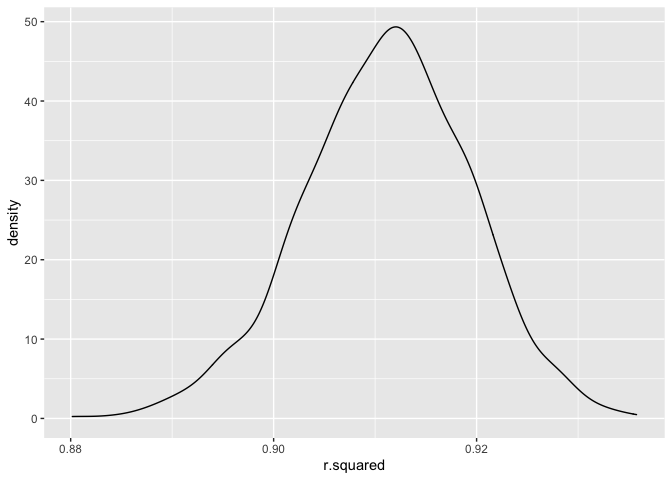
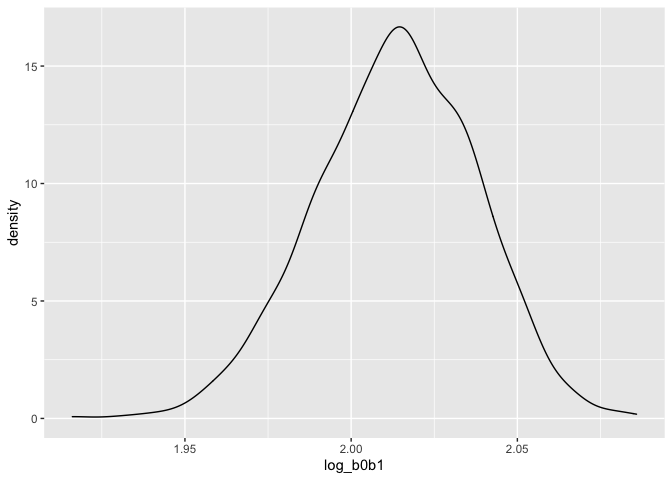

p8105_hw6_sc5154
================
Shaohan Chen
2022-11-30

``` r
library(tidyverse)
library(modelr)
library(corrplot)
```

## Problem 1

``` r
weather_df = 
  rnoaa::meteo_pull_monitors(
    c("USW00094728"),
    var = c("PRCP", "TMIN", "TMAX"), 
    date_min = "2017-01-01",
    date_max = "2017-12-31") %>%
  mutate(
    name = recode(id, USW00094728 = "CentralPark_NY"),
    tmin = tmin / 10,
    tmax = tmax / 10) %>%
  select(name, id, everything())
```

To obtain a distribution for $\hat{r}^2$, we’ll do the following steps:
\* Draw bootstrap samples; \* Generate a model to each \* Extract the
value we are concerned with \* Summarize. Here, we’ll use
`modelr::bootstrap` to draw the samples and `broom::glance` to produce
`r.squared` values.

``` r
weather_df %>% 
  modelr::bootstrap(n = 1000) %>% 
  mutate(
    models = map(strap, ~lm(tmax ~ tmin, data = .x) ),
    results = map(models, broom::glance)) %>% 
  select(-strap, -models) %>% 
  unnest(results) %>% 
  ggplot(aes(x = r.squared)) + geom_density()
```

<!-- -->

In this example, the $\hat{r}^2$ value is high, and the upper bound at 1
may account for the generally skewed shape of the distribution.

If we want to construct a confidence interval for $R^2$, we could take
the 2.5% and 97.5% quantiles of the estimates across bootstrap samples.

However, because the shape is not symmetric, using the mean +/- 1.96
times the standard error probably wouldn’t work well.

We can produce a distribution for $\log(\beta_0 * \beta1)$ using a
similar approach, with a bit more wrangling before we make our plot.

``` r
weather_df %>% 
  modelr::bootstrap(n = 1000) %>% 
  mutate(
    models = map(strap, ~lm(tmax ~ tmin, data = .x) ),
    results = map(models, broom::tidy)) %>% 
  select(-strap, -models) %>% 
  unnest(results) %>% 
  select(id = `.id`, term, estimate) %>% 
  pivot_wider(
    names_from = term, 
    values_from = estimate) %>% 
  rename(beta0 = `(Intercept)`, beta1 = tmin) %>% 
  mutate(log_b0b1 = log(beta0 * beta1)) %>% 
  ggplot(aes(x = log_b0b1)) + geom_density()
```

<!-- -->

As with $r^2$, this distribution is somewhat skewed and has some
outliers.

The point of this is not to say we should always use the bootstrap –
it’s possible to establish “large sample” distributions for strange
parameters / values / summaries in a lot of cases, and those are great
to have. But it is helpful to know that there’s a way to do inference
even in tough cases.

## Problem 2

First we import the original raw dataset.

``` r
homicide_raw = read_csv("Data/homicide-data.csv")
```

Next, we tidy the dataset according to the requirements. The steps would
include:

-   Create a `city_state` variable
-   Create a binary variable indicating whether the homicide is solved.
-   Omit some cities like Dallas which don’t report victim race.
-   Omit data entry mistake.
-   Limit the analysis those for whom `victim_race` is `white` or
    `black`.
-   Make sure that the `victim_age` is numeric.

In addition, we make sure that `victim_race`, `victim_sex` are factors,
for the convenience of further modelling.

``` r
homicide_df = 
  homicide_raw %>%
  mutate(
    city_state = str_c(city, ", ", state),
    solved = ifelse(disposition %in% c("Closed without arrest", "Open/No arrest"), FALSE, TRUE)
  ) %>%
  filter(!(city_state %in% c("Dallas, TX", "Phoenix, AZ", "Kansas City, MO", "Tulsa, AL"))) %>%
  filter(!(city_state %in% c("Tulsa, AL"))) %>%
  filter(victim_race %in% c("White", "Black")) %>%
  mutate(
    victim_age = as.numeric(victim_age),
    victim_sex = as.factor(ifelse(victim_sex == "Unknown", NA, victim_sex)),
    victim_race = as.factor(victim_race)
  )
## Warning in mask$eval_all_mutate(quo): NAs introduced by coercion
```

Now the dataset tidy process is completed.

Next, we use `glm` function to fit a logistic regression with resolved
vs. unresolved as the outcome and victim age, sex and race as predictors
for the city of Baltimore.

Later, we will save the output of the model as an R object, and apply
the `broom:tidy` to this object, and obtain the estimate and confidence
interval of the adjusted odds ratio for solving homicides comparing male
victims to female victims keeping all other variables fixed.

``` r
fit_logistic = 
  homicide_df %>%
  filter(city == "Baltimore") %>%
  glm(solved ~ victim_age + victim_sex + victim_race, data = ., family = binomial())
```

``` r
fit_logistic %>%
  broom::tidy() %>%
  mutate(
    OR = exp(estimate),
    CI_lower = exp(estimate + qnorm(0.025) * std.error),
    CI_upper = exp(estimate + qnorm(0.975) * std.error)
  ) %>%
  filter(term == "victim_sexMale") %>%
  select(OR, CI_lower, CI_upper) %>%
  knitr::kable(digits = 4)
```

|     OR | CI_lower | CI_upper |
|-------:|---------:|---------:|
| 0.4255 |   0.3246 |   0.5579 |

Now we run `glm` for each of the cities in our dataset, and extract the
adjusted odds ratio and CI for solving homicides comparing male victims
to female victims.

We will do this within a “tidy” pipeline, making use of `purrr::map`,
list columns, and unnest as necessary to create a dataframe with
estimated ORs and CIs for each city.

We first write a function for operating logistic regression for each
city. The basic structure is much like what we have written in previous
paragraph.

``` r
glm_training = function(city_data){
  glm_model = glm(solved ~ victim_age + victim_sex + victim_race, data = city_data, family = binomial())
  glm_model %>%
    broom::tidy() %>%
    mutate(
      OR = exp(estimate),
      CI_lower = exp(estimate + qnorm(0.025) * std.error),
      CI_upper = exp(estimate + qnorm(0.975) * std.error)
    ) %>%
    filter(term == "victim_sexMale") %>%
    select(OR, CI_lower, CI_upper)
}
```

``` r
cities_OR = 
  homicide_df %>%
  select(city_state:solved, victim_race:victim_sex) %>%
  nest(input_data = solved:victim_sex) %>%
  mutate(
    fit_logistic_city = purrr::map(input_data, glm_training)
  ) %>%
  select(city_state, fit_logistic_city) %>%
  unnest(fit_logistic_city)
```

Finally, we make a plot that shows the estimated ORs and CIs for each
city. And we will organize cities according to estimated OR, and comment
on the plot.

The source data of estimated ORs and CIs look like this:

``` r
head(cities_OR, 5)
## # A tibble: 5 × 4
##   city_state         OR CI_lower CI_upper
##   <chr>           <dbl>    <dbl>    <dbl>
## 1 Albuquerque, NM 1.77     0.831    3.76 
## 2 Atlanta, GA     1.00     0.684    1.46 
## 3 Baltimore, MD   0.426    0.325    0.558
## 4 Baton Rouge, LA 0.381    0.209    0.695
## 5 Birmingham, AL  0.870    0.574    1.32
```

The plot is:

``` r
cities_OR %>%
  mutate(
    city_state = fct_reorder(city_state, OR)
  ) %>%
  ggplot(aes(
    x = city_state,
    y = OR
  )) +
  geom_point() +
  geom_errorbar(aes(
    ymax = CI_upper,
    ymin = CI_lower
  )) +
  labs(
    title = "Odd Ratio's estimate & CI of solving homicides: male victims compared with female victims",
    x = "City, State",
    y = "Odds Ratio"
  ) + 
  theme(
    title = element_text(size = 8),
    axis.text.x = element_text(angle = 60, hjust = 1)
  )
```

<!-- -->

### Problem 3

First we import the original raw dataset.

``` r
birthweight_raw = 
  read_csv("Data/birthweight.csv")
```

Then we clean the dataset for further regression analysis, which will
include:

-   Convert numeric to factor where appropriate
-   Check and omit the missing data.

After checking the dataset, we found that the columns `pnumlbw` and
`pnumsga` didn’t contain useful information, so we just remove them.

``` r
birthweight_df = 
  birthweight_raw %>%
  mutate(
    babysex = as.factor(babysex),
    frace = as.factor(frace),
    malform = as.factor(malform),
    mrace = as.factor(mrace)
  ) %>%
  select(-pnumsga, -pnumlbw) %>%
  na.omit() 
```

Next, we choose the features we would like to put in the regression
model. After reading the description of the dataset, I think the
following features should be put into model:

1.  The physiological information of babies, because it directly reflect
    the condition of baby, which include:

-   babysex
-   bhead
-   blength

2.  The physiological information of mother and father as well as the
    pregnancy status, because the heath conditions of parents must have
    strong connection with the baby (especially like smoking status),
    and that include:

-   delwt
-   frace
-   mrace
-   momage
-   menarche

3.  The information of pregancy, since the pregancy status would also
    impact the baby’s weight, and that include:

-   wtgain
-   smoken
-   ppbmi
-   malform
-   smoken

And we also take a brief look at the features from data-driven aspects.
We calculate the correlation between the features.

``` r
numeric_variables = 
  birthweight_df %>%
  select(-babysex, -frace, -malform, -mrace)

factor_variables = 
  birthweight_df %>%
  select(babysex, frace, malform, mrace, bwt) %>%
  mutate(
    babysex = as.numeric(babysex),
    frace = as.numeric(frace),
    malform = as.numeric(malform),
    mrace = as.numeric(mrace)
  )

numeric_variables %>%
  cor() %>%
  corrplot()
```

<!-- -->

``` r

factor_variables %>%
  cor() %>%
  corrplot()
```

<!-- -->

And the results shows that some of the variables have a obvious
correlation with the `bwt`.

Combining all the analysis above, we decide to choose the following
variables into consideration: `bhead`, `blength`, `delwt`, `gaweeks`,
`ppbmi`, `smoken`, `wtgain`, `babysex`, `mrace`.

Now we build the linear regression model.

``` r
lm_model = lm(bwt ~ babysex + bhead + blength + delwt + gaweeks + ppbmi + smoken + wtgain + mrace, data = birthweight_df)

summary(lm_model)
## 
## Call:
## lm(formula = bwt ~ babysex + bhead + blength + delwt + gaweeks + 
##     ppbmi + smoken + wtgain + mrace, data = birthweight_df)
## 
## Residuals:
##     Min      1Q  Median      3Q     Max 
## -1100.3  -183.5    -2.5   175.1  2337.1 
## 
## Coefficients:
##               Estimate Std. Error t value Pr(>|t|)    
## (Intercept) -5661.1349   101.0825 -56.005  < 2e-16 ***
## babysex2       28.9205     8.4589   3.419 0.000634 ***
## bhead         131.2420     3.4464  38.081  < 2e-16 ***
## blength        74.7585     2.0186  37.034  < 2e-16 ***
## delwt           3.0970     0.4104   7.547 5.41e-14 ***
## gaweeks        11.3990     1.4581   7.818 6.69e-15 ***
## ppbmi          -9.5357     2.5717  -3.708 0.000212 ***
## smoken         -4.8796     0.5859  -8.329  < 2e-16 ***
## wtgain          1.0097     0.5660   1.784 0.074510 .  
## mrace2       -145.6393     9.2300 -15.779  < 2e-16 ***
## mrace3        -79.7290    42.3152  -1.884 0.059609 .  
## mrace4       -107.7551    19.0777  -5.648 1.72e-08 ***
## ---
## Signif. codes:  0 '***' 0.001 '**' 0.01 '*' 0.05 '.' 0.1 ' ' 1
## 
## Residual standard error: 272.6 on 4330 degrees of freedom
## Multiple R-squared:  0.7175, Adjusted R-squared:  0.7167 
## F-statistic: 999.6 on 11 and 4330 DF,  p-value: < 2.2e-16
```

The prediction results seem to be good and the features are generally
significant.

Now we make a plot of model residuals against fitted values, and we will
use add_predictions and add_residuals in making this plot.

``` r
birthweight_df %>%
  add_residuals(lm_model) %>%
  add_predictions(lm_model) %>%
  ggplot(aes(
    x = pred,
    y = resid
  )) + 
  geom_point(alpha = 0.5) +
  geom_smooth() +
  labs(
    x = "Fitted Values",
    y = "Model Residuals"
  )
```

<!-- -->

Then, we compare our model to two other models.

``` r
cv_df = 
  crossv_mc(birthweight_df, 100) %>%
  mutate(
    train = map(train, as_tibble),
    test = map(test, as_tibble)
  )
```

``` r
cv_df = 
  cv_df %>%
  mutate(
    lm_model_1 = map(.x = train, ~lm(bwt ~ babysex + bhead + blength + delwt + gaweeks + ppbmi + smoken + wtgain + mrace, data = birthweight_df)),
    lm_model_2 = map(.x = train, ~lm(bwt ~ blength + gaweeks, data = birthweight_df)),
    lm_model_3 = map(.x = train, ~lm(bwt ~ bhead + blength + babysex + bhead * blength + blength * babysex + bhead * babysex + bhead * blength * babysex, data = birthweight_df))
  ) %>%
  mutate(
    rmse_model_1 = map2_dbl(lm_model_1, test, ~rmse(model = .x, data = .y)),
    rmse_model_2 = map2_dbl(lm_model_2, test, ~rmse(model = .x, data = .y)),
    rmse_model_3 = map2_dbl(lm_model_3, test, ~rmse(model = .x, data = .y)),
  )
```

We make a violin plot to make a comparison between different models.

``` r
cv_df %>% 
  select(starts_with("rmse")) %>% 
  pivot_longer(
    everything(),
    names_to = "model", 
    values_to = "rmse",
    names_prefix = "rmse_") %>% 
  mutate(model = fct_inorder(model)) %>% 
  ggplot(aes(x = model, y = rmse)) + 
  geom_violin()
```

<!-- -->

From the violin plot, we can see that our model `model_1` has the
overall lowest rmse result and the overall best prediction performance
compared with two others (if only based on this violin plot). And
`model_3` also performs better than `model_2` according to the plot. It
may because our model contains more useful explanatory features, so our
model predicts more accurately. But we still need further analysis and
investigation on whether our model truly performs best compared with the
other two from different aspects.
